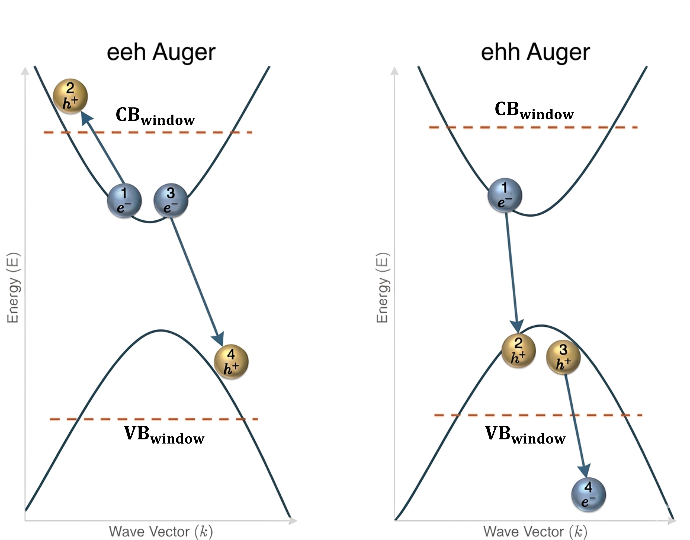

# pyAuger — ab-initio Auger Recombination Calculator

[](https://github.com/Hamza-Alhasan-22/pyAuger/actions/workflows/tests.yml)


A Python package for calculating direct Auger recombination coefficients
(**C_n** and **C_p**) for semiconductors using first-principles VASP data.

<p align="center">
  
</p>

---

## Installation

```bash
# Clone the repository
git clone https://github.com/Hamza-Alhasan-22/pyAuger
cd pyAuger

# Install in editable mode
pip install -e .
```

Or download easily and directly using pip:

```bash
pip install git+https://github.com/Hamza-Alhasan-22/pyAuger
```

**Dependencies:** `numpy`, `scipy`, `pandas`, `matplotlib`, `pymatgen`, `pyvaspwfc`

The code was created and tested with the following versions:
- python 3.12.12
- numpy 2.4.2
- scipy 1.16.3
- pandas 2.2.3
- matplotlib 3.10.7
- [pymatgen](https://github.com/materialsproject/pymatgen/tree/master) 2025.10.7
- [pyvaspwfc](https://github.com/QijingZheng/VaspBandUnfolding/tree/master) 1.0

---

## Concepts

Thanks to the paper [Kioupakis et al., 2015](https://doi.org/10.1103/PhysRevB.92.035207) as the code was built based on its background theory.

### Auger types

| Type | Notation | Physical process | Output |
|------|----------|-----------------|--------|
| **eeh** | electron–electron–hole | Two CB electrons scatter; one recombines with a VB hole | C_n |
| **ehh** | electron–hole–hole | A CB electron recombines with two VB holes scattering | C_p |

The total Auger coefficient is: **C_Auger = C_n + C_p**. The eeh and the ehh Auger recombinations and the carrier indices used in the code are shown in this figure:

<p align="center">
  
</p>


### Auger coefficient equation

The Auger coefficient is evaluated via Fermi's Golden Rule:

$$C_n = \frac{4\pi}{\hbar} \frac{1}{n^2 p - n_i^2 n} \sum_{\text{pairs}} P \cdot |M|^2 \cdot \delta(\Delta E)$$

where **P** is the Fermi–Dirac occupation-weighted probability, **|M|²** is the screened Coulomb matrix element, and **δ(ΔE)** enforces energy conservation (approximated by Gaussian, Lorentzian, or Rectangular broadening).

### Two approaches for the 4th state

When three states (1, 2, 3) are chosen, the 4th state must satisfy
**momentum conservation**: **k₁ + k₂ = k₃ + k₄**.

| Approach | Description | NSCF needed? |
|----------|-------------|-------------|
| `nearest_kpoint` | Finds the nearest k-point in the SCF grid to the exact k₄ vector | No |
| `exact_kpoint` | Runs NSCF calculations at the exact required k-points | Yes |

> **Note:** The `nearest_kpoint` approach requires `ISYM = -1` in the VASP INCAR so that the full BZ k-mesh is available. The `exact_kpoint` approach does not have this requirement. More info in the tutorials.

### Delta function approximations

Energy conservation is enforced via broadened delta functions. Three are available:

| Name | Character |
|------|-----------|
| `Gaussian` | Smooth, most commonly used |
| `Lorentzian` | Longer tails |
| `Rectangular` | Sharp cutoff |

### k-grid convergence:
Auger recombination coefficients are sensitive to the density of the k-point grid used in the DFT calculation. Converged results typically require dense k-grids (depending on the material). It is recommended to repeat the full Auger calculation at several k-grid sizes using the same settings and verify that the computed coefficients have converged before reporting final values.

---

### How to use pyAuger?

The recommended starting point is the full notebook tutorial:

- [`tutorials/main_tutorial.ipynb`](tutorials/main_tutorial.ipynb)
  Walks through the complete Python workflow: parsing VASP data, choosing carrier/energy-window settings, generating Auger pairs, calculating matrix elements, and computing Auger coefficients.

For quick, script-based examples, use:

- [`tutorials/example_nearest_kpoint.py`](tutorials/example_nearest_kpoint.py)
  Simple and complete workflow for the `nearest_kpoint` approach.
- [`tutorials/example_exact_kpoint_step1.py`](tutorials/example_exact_kpoint_step1.py)
  Step 1 of the `exact_kpoint` workflow: generate exact k-points and prepare NSCF folders.
- [`tutorials/example_exact_kpoint_step2.py`](tutorials/example_exact_kpoint_step2.py)
  Step 2 of the `exact_kpoint` workflow: after NSCF VASP runs finish, generate pairs, calculate matrix elements, and compute rates.

For larger calculations, pyAuger also provides standalone C++ executables for pair generation and matrix-element calculation:

- [`tutorials/cpp_workflow/full_cpp_tutorial.ipynb`](tutorials/cpp_workflow/full_cpp_tutorial.ipynb)
  Full C++ workflow tutorial, including how to build the C++ executables and how to run both `nearest_kpoint` and `exact_kpoint` workflows.
- [`tutorials/cpp_workflow/example_cpp_nearest_kpoint.py`](tutorials/cpp_workflow/example_cpp_nearest_kpoint.py)
  Quick script for the C++ `nearest_kpoint` workflow.
- [`tutorials/cpp_workflow/example_cpp_exact_kpoint_step1.py`](tutorials/cpp_workflow/example_cpp_exact_kpoint_step1.py)
  C++ exact-kpoint step 1: generate exact k-points and prepare NSCF folders.
- [`tutorials/cpp_workflow/example_cpp_exact_kpoint_step2.py`](tutorials/cpp_workflow/example_cpp_exact_kpoint_step2.py)
  C++ exact-kpoint step 2: generate final pairs, calculate matrix elements, and compute rates.

General workflow:

1. Prepare a VASP SCF calculation with the required files: `EIGENVAL`, `vasprun.xml`, `KPOINTS`, `POSCAR`, and `WAVECAR`.
2. Choose either `nearest_kpoint` or `exact_kpoint`.
3. Run the matching tutorial or quick script.
4. For `exact_kpoint`, run the generated NSCF VASP calculations before continuing to step 2 of the workflow.
5. Check k-grid convergence before using final Auger coefficients.

---

# Tests

See [`docs/testing.md`](docs/testing.md) for the full testing guide.

Default lightweight test command:

```bash
python -m pytest
```
---

## How to cite pyAuger

<!-- TODO -->

---

## License

This project is licensed under the [MIT License](LICENSE).
